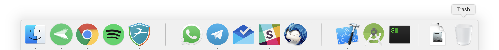

# macOS Dock Separator
macOS application to add a vertical or horizontal bar to Dock similar to the default one.

## How to use
Open this project with XCode 9+. Then follow the steps:

- Select desired app version - Vertical, LeftBar or RightBar for Dock being at bottom, left or right sides of the screen
- "Product" > "Archive"
- Click on the archived application, then select the blue "Distribute App" button on right
- Choose "Copy App"
- Select the desired local directory

When you open the exported directory, you'll find the application.
Now you can make as many copies of this application as you wish.

## Screenshot

